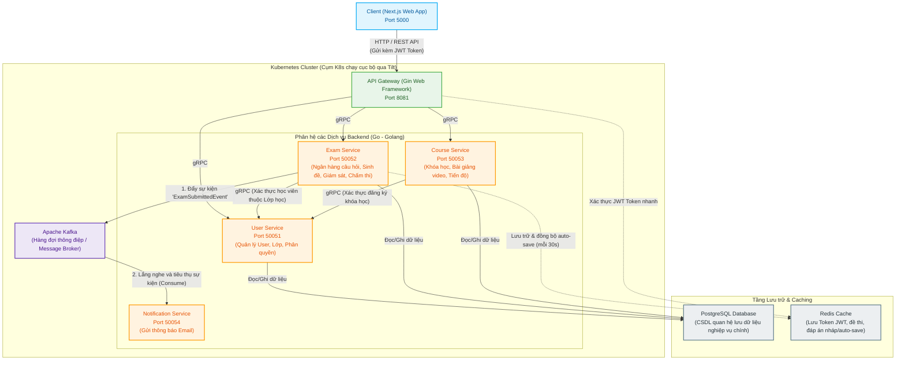

# Kiến trúc Hệ thống Backend JQK Study

Tài liệu này trình bày sơ đồ kiến trúc hệ thống và cách các thành phần/dịch vụ giao tiếp với nhau trong hệ thống backend **JQK Study**.

## 1. Sơ đồ Kiến trúc Hệ thống (System Architecture)

Dưới đây là sơ đồ chi tiết biểu diễn luồng yêu cầu từ Client qua API Gateway, cách các Microservice giao tiếp đồng bộ (gRPC) và bất đồng bộ (Kafka), cùng với tầng dữ liệu (PostgreSQL và Redis Cache).

---

## 2. Chi tiết các giao thức giao tiếp (Communication Protocols)

Hệ thống kết hợp 3 hình thức giao tiếp chính tùy thuộc vào mục đích nghiệp vụ:

### A. Giao tiếp Client - Backend (HTTP / REST API)
*   **Mô tả**: Next.js frontend giao tiếp trực tiếp với **API Gateway** bằng giao thức HTTP/1.1 thông qua RESTful API.
*   **Xác thực**: Sử dụng mã thông báo bảo mật **JWT (JSON Web Token)** đính kèm trong Header `Authorization: Bearer <Token>`. API Gateway chịu trách nhiệm giải mã, kiểm tra tính hợp lệ của token (tra cứu Redis nếu cần) trước khi điều hướng yêu cầu.

### B. Giao tiếp Đồng bộ Nội bộ (gRPC / Protocol Buffers)
*   **Mô tả**: Khi API Gateway nhận yêu cầu hoặc khi các dịch vụ cần gọi lẫn nhau, chúng sử dụng **gRPC** chạy trên nền tảng truyền tải HTTP/2.
*   **Lý do chọn**: gRPC sử dụng **Protocol Buffers (protobuf)** để tuần tự hóa dữ liệu thành định dạng nhị phân cực kỳ nhỏ gọn, giảm băng thông mạng, và cho phép gọi hàm nội bộ với độ trễ tối thiểu (gần như bằng 0).
*   **Ví dụ**:
    *   Khi Học viên truy cập vào bài thi, `Exam Service` sẽ gọi qua gRPC tới `User Service` để kiểm tra học viên đó có nằm trong danh sách thành viên của lớp học được gán đề thi này hay không.

### C. Giao tiếp Bất đồng bộ (Event-Driven via Apache Kafka)
*   **Mô tả**: Đối với các tác vụ tốn thời gian hoặc không cần phản hồi ngay lập tức cho người dùng, hệ thống sử dụng kiến trúc định hướng sự kiện thông qua hàng đợi thông điệp **Apache Kafka**.
*   **Ví dụ (Quy trình Nộp bài thi)**:
    1.  Học viên bấm nộp bài, `Exam Service` tính điểm ngay lập tức, lưu kết quả vào database và phản hồi điểm cho Học viên (đáp ứng nhanh).
    2.  Đồng thời, `Exam Service` tạo một sự kiện `ExamSubmittedEvent` chứa thông tin bài thi của học viên đó và đẩy (Publish) vào **Kafka**.
    3.  `Notification Service` liên tục lắng nghe (Subscribe) chủ đề (topic) liên quan trên Kafka. Khi nhận được thông điệp mới, nó sẽ tự động biên dịch mẫu email và gửi thông báo kết quả thi đến hòm thư của học viên đó một cách bất đồng bộ mà không làm chậm trải nghiệm của thí sinh.

---

## 3. Vai trò của tầng CSDL và Bộ nhớ đệm (PostgreSQL & Redis)

*   **PostgreSQL**: Cơ sở dữ liệu quan hệ chính. Các service được thiết kế với cơ sở dữ liệu độc lập (hoặc schema tách biệt) để đảm bảo tính cô lập của kiến trúc microservices. Bất kỳ dịch vụ nào muốn truy xuất dữ liệu của dịch vụ khác đều phải thông qua giao tiếp gRPC API thay vì query trực tiếp vào bảng.
*   **Redis**: 
    *   Lưu thông tin cache phiên đăng nhập của người dùng.
    *   Lưu trữ đáp án nháp của thí sinh: Nhằm tránh mất mát bài thi khi xảy ra sự cố mạng, trình duyệt gửi lưu nháp (`auto-save`) mỗi 30 giây lên Redis trước khi kết thúc kỳ thi và ghi nhận chính thức vào PostgreSQL.
