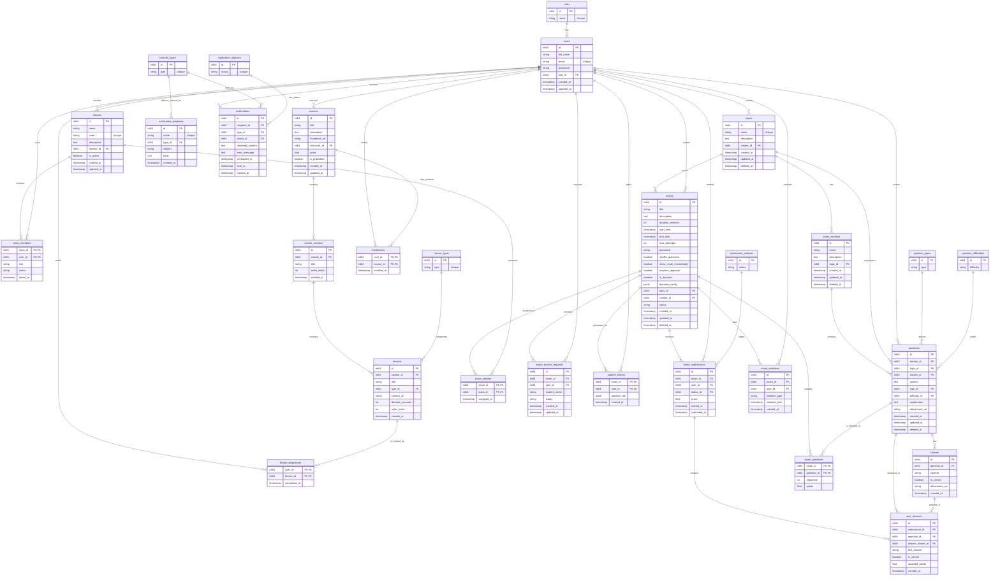

# Database Entity-Relationship Diagram

```mermaid
erDiagram
    %% ==========================================
    %% USER SERVICE
    %% ==========================================
    roles {
        int64 id PK
        string name "Unique"
    }

    users {
        int64 id PK
        string full_name
        string email "Unique"
        string password
        int64 role_id FK
        timestamp created_at
        timestamp updated_at
    }

    classes {
        int64 id PK
        string name
        string code "Unique"
        text description
        int64 teacher_id FK
        boolean is_active
        timestamp created_at
        timestamp updated_at
    }

    class_members {
        int64 class_id PK, FK
        int64 user_id PK, FK
        string role
        string status
        timestamp joined_at
    }

    roles ||--o{ users : "has"
    users ||--o{ classes : "teaches"
    classes ||--o{ class_members : "includes"
    users ||--o{ class_members : "joins"

    %% ==========================================
    %% COURSE SERVICE
    %% ==========================================
    courses {
        int64 id PK
        string title
        text description
        string thumbnail_url
        int64 instructor_id FK
        float price
        boolean is_published
        timestamp created_at
        timestamp updated_at
    }

    course_sections {
        int64 id PK
        int64 course_id FK
        string title
        int order_index
        timestamp created_at
    }

    lesson_types {
        int64 id PK
        string type "Unique"
    }

    lessons {
        int64 id PK
        int64 section_id FK
        string title
        int64 type_id FK
        string content_url
        int duration_seconds
        int order_index
        timestamp created_at
    }

    enrollments {
        int64 user_id PK, FK
        int64 course_id PK, FK
        timestamp enrolled_at
    }

    lesson_progresses {
        int64 user_id PK, FK
        int64 lesson_id PK, FK
        timestamp completed_at
    }

    users ||--o{ courses : "instructs"
    courses ||--o{ course_sections : "contains"
    course_sections ||--o{ lessons : "contains"
    lesson_types ||--o{ lessons : "categorizes"
    users ||--o{ enrollments : "enrolls"
    courses ||--o{ enrollments : "has_students"
    users ||--o{ lesson_progresses : "tracks"
    lessons ||--o{ lesson_progresses : "is_tracked_by"

    %% ==========================================
    %% EXAM SERVICE
    %% ==========================================
    topics {
        int64 id PK
        string name "Unique"
        text description
        int64 creator_id FK
        timestamp created_at
        timestamp updated_at
        timestamp deleted_at
    }

    exam_sections {
        int64 id PK
        string name
        text description
        int64 topic_id FK
        timestamp created_at
        timestamp updated_at
        timestamp deleted_at
    }

    question_difficulties {
        int64 id PK
        string difficulty
    }

    question_types {
        int64 id PK
        string type
    }

    questions {
        int64 id PK
        int64 section_id FK
        int64 topic_id FK
        int64 creator_id FK
        text content
        int64 type_id FK
        int64 difficulty_id FK
        text explanation
        string attachment_url
        timestamp created_at
        timestamp updated_at
        timestamp deleted_at
    }

    choices {
        int64 id PK
        int64 question_id FK
        string content
        boolean is_correct
        string attachment_url
        timestamp created_at
    }

    exams {
        int64 id PK
        string title
        text description
        int duration_minutes
        timestamp start_time
        timestamp end_time
        int max_attempts
        string password
        boolean shuffle_questions
        boolean show_result_immediately
        boolean requires_approval
        boolean is_dynamic
        jsonb dynamic_config
        int64 topic_id FK
        int64 creator_id FK
        string status
        timestamp created_at
        timestamp updated_at
        timestamp deleted_at
    }

    exam_questions {
        int64 exam_id PK, FK
        int64 question_id PK, FK
        int sequence
        float points
    }

    exam_classes {
        int64 exam_id PK, FK
        int64 class_id PK, FK
        timestamp assigned_at
    }

    exam_access_requests {
        int64 id PK
        int64 exam_id FK
        int64 user_id FK
        string student_name
        string status
        timestamp created_at
        timestamp updated_at
    }

    student_exams {
        int64 exam_id PK, FK
        int64 user_id PK, FK
        jsonb question_ids
        timestamp created_at
    }

    submission_statuses {
        int64 id PK
        string status
    }

    exam_submissions {
        int64 id PK
        int64 exam_id FK
        int64 user_id FK
        int64 status_id FK
        float score
        timestamp started_at
        timestamp submitted_at
    }

    user_answers {
        int64 id PK
        int64 submission_id FK
        int64 question_id FK
        int64 chosen_choice_id FK
        string text_answer
        boolean is_correct
        float awarded_points
        timestamp created_at
    }

    exam_violations {
        int64 id PK
        int64 exam_id FK
        int64 user_id FK
        string violation_type
        timestamp violation_time
        timestamp created_at
    }

    users ||--o{ topics : "creates"
    topics ||--o{ exam_sections : "has"
    exam_sections ||--o{ questions : "contains"
    topics ||--o{ questions : "categorizes"
    users ||--o{ questions : "creates"
    question_types ||--o{ questions : "defines"
    question_difficulties ||--o{ questions : "levels"
    questions ||--o{ choices : "has"
    topics ||--o{ exams : "covers"
    users ||--o{ exams : "creates"
    exams ||--o{ exam_questions : "includes"
    questions ||--o{ exam_questions : "is_included_in"
    exams ||--o{ exam_classes : "assigned_to"
    classes ||--o{ exam_classes : "assigned"
    exams ||--o{ exam_access_requests : "receives"
    users ||--o{ exam_access_requests : "requests"
    exams ||--o{ student_exams : "generated_for"
    users ||--o{ student_exams : "takes"
    exams ||--o{ exam_submissions : "receives"
    users ||--o{ exam_submissions : "submits"
    submission_statuses ||--o{ exam_submissions : "states"
    exam_submissions ||--o{ user_answers : "contains"
    questions ||--o{ user_answers : "answered_in"
    choices ||--o{ user_answers : "selected_in"
    exams ||--o{ exam_violations : "logs"
    users ||--o{ exam_violations : "commits"

    %% ==========================================
    %% NOTIFICATION SERVICE
    %% ==========================================
    channel_types {
        int64 id PK
        string type "Unique"
    }

    notification_statuses {
        int64 id PK
        string status "Unique"
    }

    notification_templates {
        int64 id PK
        string name "Unique"
        int64 type_id FK
        string subject
        text body
        timestamp created_at
    }

    notifications {
        int64 id PK
        int64 recipient_id FK
        int64 type_id FK
        int64 status_id FK
        text rendered_content
        text error_message
        timestamp scheduled_at
        timestamp sent_at
        timestamp created_at
    }

    channel_types ||--o{ notification_templates : "defines_channel_for"
    users ||--o{ notifications : "receives"
    channel_types ||--o{ notifications : "sent_via"
    notification_statuses ||--o{ notifications : "has_status"
```
