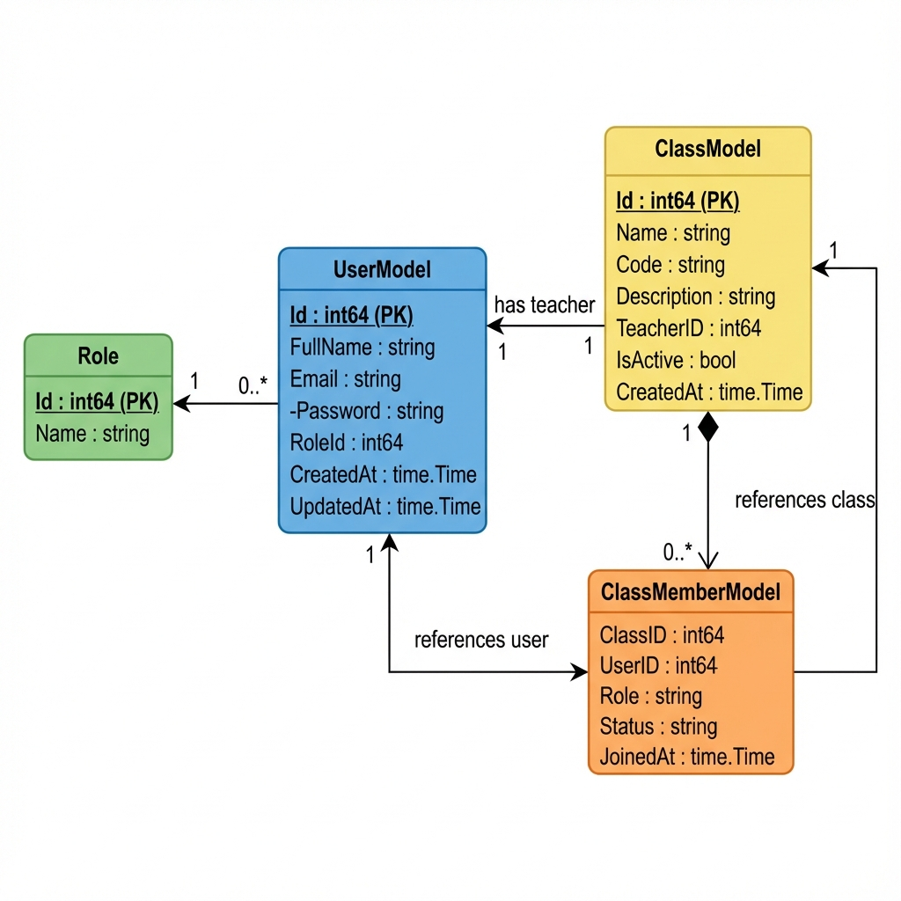
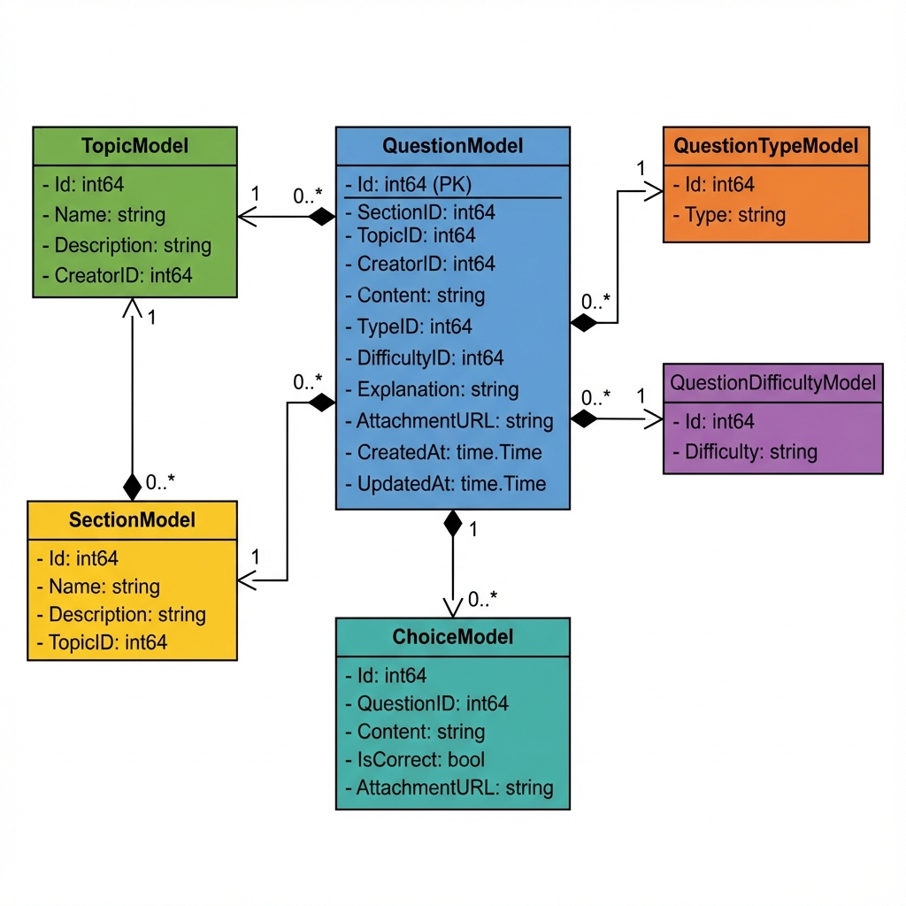
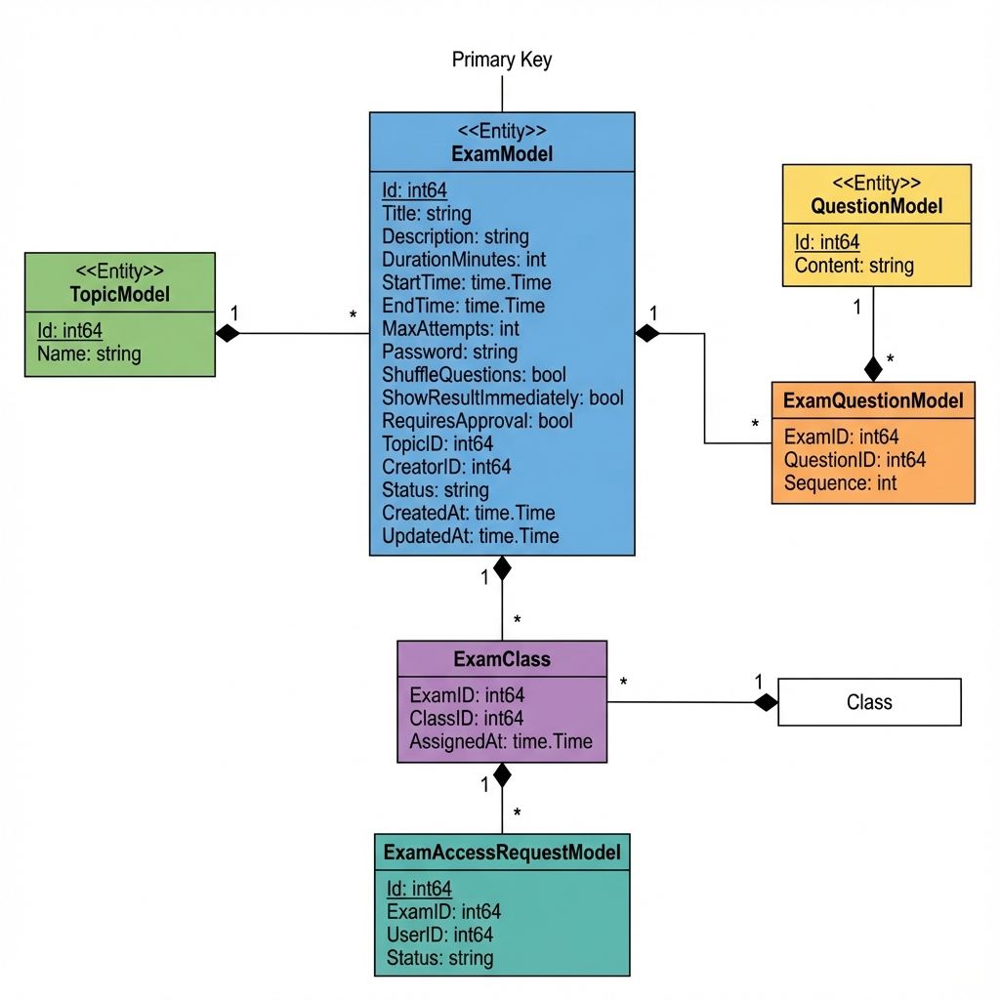
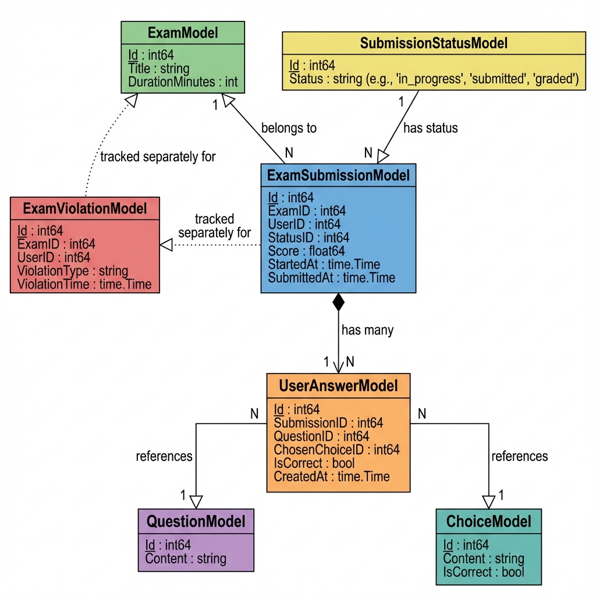

# Thiết Kế Lớp - Class Diagrams

Tài liệu này trình bày thiết kế lớp cho các entity chính trong hệ thống thi trực tuyến.

---

## a. Lớp Người Dùng (User)

### Mô tả
Lớp `UserModel` quản lý thông tin người dùng trong hệ thống, bao gồm học sinh, giáo viên và quản trị viên. Liên kết với các lớp `Role`, `ClassModel` và `ClassMemberModel`.

### Class Diagram



### Chi tiết các lớp

| Lớp | Thuộc tính | Mô tả |
|-----|------------|-------|
| **UserModel** | Id, FullName, Email, Password, RoleId, CreatedAt, UpdatedAt | Thông tin người dùng chính |
| **Role** | Id, Name | Vai trò: admin, instructor, student |
| **ClassModel** | Id, Name, Code, Description, TeacherID, IsActive | Lớp học |
| **ClassMemberModel** | ClassID, UserID, Role, Status, JoinedAt | Thành viên trong lớp |

### Quan hệ
- `UserModel` **N:1** `Role` - Mỗi user có một vai trò
- `ClassModel` **N:1** `UserModel` (Teacher) - Mỗi lớp có một giáo viên
- `ClassModel` **1:N** `ClassMemberModel` - Lớp có nhiều thành viên
- `ClassMemberModel` **N:1** `UserModel` - Thành viên là user

---

## b. Lớp Câu Hỏi (Question)

### Mô tả
Lớp `QuestionModel` lưu trữ các câu hỏi thi, được tổ chức theo chủ đề (Topic) và phần (Section). Mỗi câu hỏi có loại, độ khó và các lựa chọn.

### Class Diagram



### Chi tiết các lớp

| Lớp | Thuộc tính | Mô tả |
|-----|------------|-------|
| **QuestionModel** | Id, Content, SectionID, TopicID, TypeID, DifficultyID, Explanation, AttachmentURL | Câu hỏi |
| **TopicModel** | Id, Name, Description, CreatorID | Chủ đề (Toán, Lý, Hóa...) |
| **SectionModel** | Id, Name, Description, TopicID | Phần trong chủ đề |
| **QuestionTypeModel** | Id, Type | Loại: multiple_choice, true_false |
| **QuestionDifficultyModel** | Id, Difficulty | Độ khó: easy, medium, hard |
| **ChoiceModel** | Id, QuestionID, Content, IsCorrect, AttachmentURL | Đáp án |

### Quan hệ
- `TopicModel` **1:N** `SectionModel` - Chủ đề có nhiều phần
- `SectionModel` **1:N** `QuestionModel` - Phần có nhiều câu hỏi
- `QuestionModel` **N:1** `QuestionTypeModel` - Câu hỏi có loại
- `QuestionModel` **N:1** `QuestionDifficultyModel` - Câu hỏi có độ khó
- `QuestionModel` **1:N** `ChoiceModel` - Câu hỏi có nhiều đáp án

---

## c. Lớp Đề Thi (Exam)

### Mô tả
Lớp `ExamModel` quản lý đề thi, bao gồm cài đặt thời gian, mật khẩu bảo vệ, và danh sách câu hỏi. Đề thi có thể được gán cho các lớp học.

### Class Diagram



### Chi tiết các lớp

| Lớp | Thuộc tính | Mô tả |
|-----|------------|-------|
| **ExamModel** | Id, Title, Description, DurationMinutes, StartTime, EndTime, MaxAttempts, Password, ShuffleQuestions, RequiresApproval, Status | Đề thi |
| **ExamQuestionModel** | ExamID, QuestionID, Sequence | Bảng liên kết N:N exam-question |
| **ExamClass** | ExamID, ClassID, AssignedAt | Gán đề thi cho lớp |
| **ExamAccessRequestModel** | Id, ExamID, UserID, StudentName, Status | Yêu cầu truy cập đề thi |

### Quan hệ
- `ExamModel` **N:1** `TopicModel` - Đề thi thuộc chủ đề
- `ExamModel` **N:N** `QuestionModel` (qua `ExamQuestionModel`) - Đề thi có nhiều câu hỏi
- `ExamModel` **N:N** `ClassModel` (qua `ExamClass`) - Đề thi gán cho nhiều lớp
- `ExamModel` **1:N** `ExamAccessRequestModel` - Đề thi có nhiều yêu cầu truy cập

---

## d. Lớp Bài Nộp (Submission)

### Mô tả
Lớp `ExamSubmissionModel` lưu trữ bài làm của học sinh, bao gồm điểm số, thời gian, và các câu trả lời. Hỗ trợ theo dõi vi phạm trong quá trình thi.

### Class Diagram



### Chi tiết các lớp

| Lớp | Thuộc tính | Mô tả |
|-----|------------|-------|
| **ExamSubmissionModel** | Id, ExamID, UserID, StatusID, Score, StartedAt, SubmittedAt | Bài nộp |
| **SubmissionStatusModel** | Id, Status | Trạng thái: in_progress, submitted, graded |
| **UserAnswerModel** | Id, SubmissionID, QuestionID, ChosenChoiceID, IsCorrect | Câu trả lời |
| **ExamViolationModel** | Id, ExamID, UserID, ViolationType, ViolationTime | Vi phạm thi |

### Quan hệ
- `ExamSubmissionModel` **N:1** `ExamModel` - Bài nộp thuộc đề thi
- `ExamSubmissionModel` **N:1** `UserModel` - Bài nộp của học sinh
- `ExamSubmissionModel` **N:1** `SubmissionStatusModel` - Bài nộp có trạng thái
- `ExamSubmissionModel` **1:N** `UserAnswerModel` - Bài nộp có nhiều câu trả lời
- `UserAnswerModel` **N:1** `QuestionModel` - Câu trả lời cho câu hỏi
- `UserAnswerModel` **N:1** `ChoiceModel` - Đáp án được chọn

---

## Tổng Quan Quan Hệ Giữa Các Lớp Chính

```
┌──────────────┐     ┌──────────────┐     ┌──────────────┐
│   UserModel  │────>│  ClassModel  │<────│  ExamClass   │
└──────────────┘     └──────────────┘     └──────────────┘
       │                                         │
       │                                         ▼
       │             ┌──────────────┐     ┌──────────────┐
       │             │  TopicModel  │<────│  ExamModel   │
       │             └──────────────┘     └──────────────┘
       │                    │                    │
       │                    ▼                    │
       │             ┌──────────────┐            │
       │             │ SectionModel │            │
       │             └──────────────┘            │
       │                    │                    │
       │                    ▼                    ▼
       │             ┌──────────────┐     ┌──────────────┐
       └────────────>│QuestionModel │<────│ExamQuestion  │
                     └──────────────┘     └──────────────┘
                            │
                            ▼
                     ┌──────────────┐     ┌──────────────┐
                     │ ChoiceModel  │<────│UserAnswerModel│
                     └──────────────┘     └──────────────┘
                                                 │
                                                 ▼
                                          ┌──────────────┐
                                          │ Submission   │
                                          └──────────────┘
```
